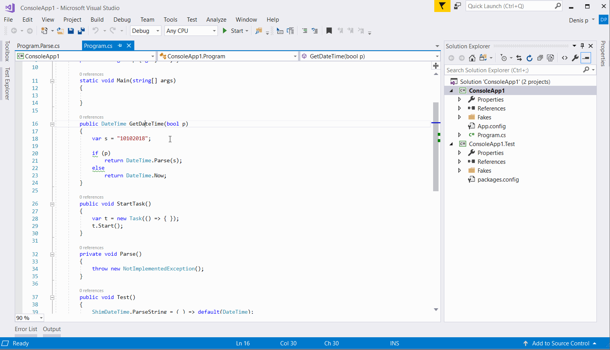

# Automock VisualStudio extension

Automock is a Visual Studio extension that generates a template of Unit Test for a method. You just need to right click on method, choose quick actions (or Ctr+Enter) and then "Generate Test Template". 

:warning: Automock uses `Microsoft.QualityTools.Testing.Fakes` that are supported in VS Enterprise only.
